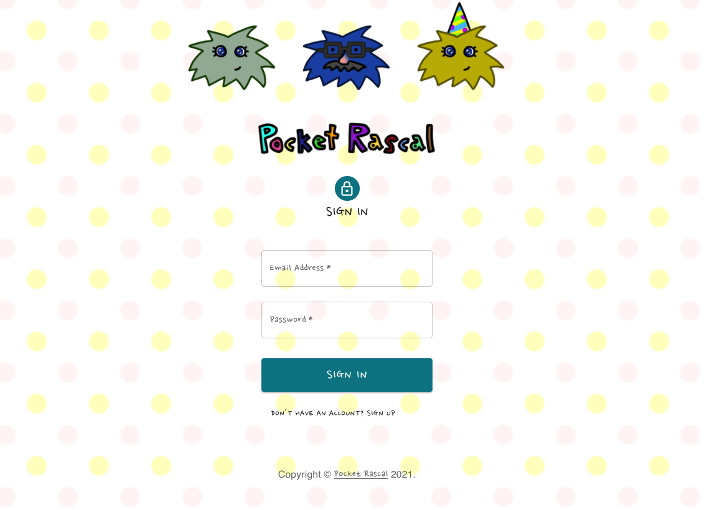
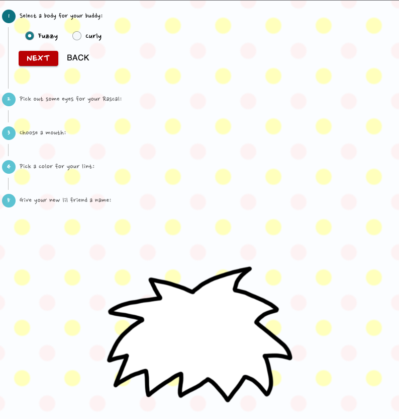
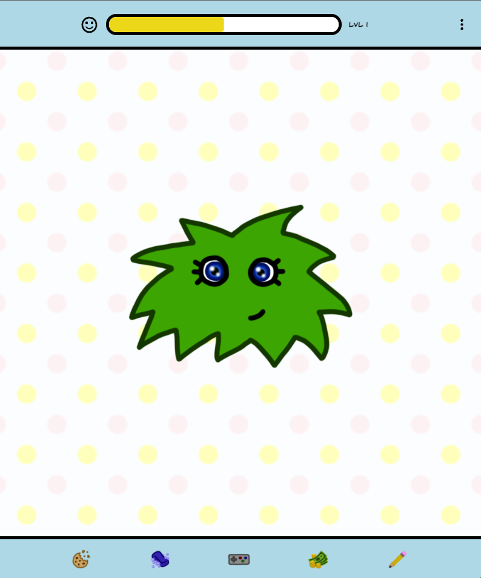
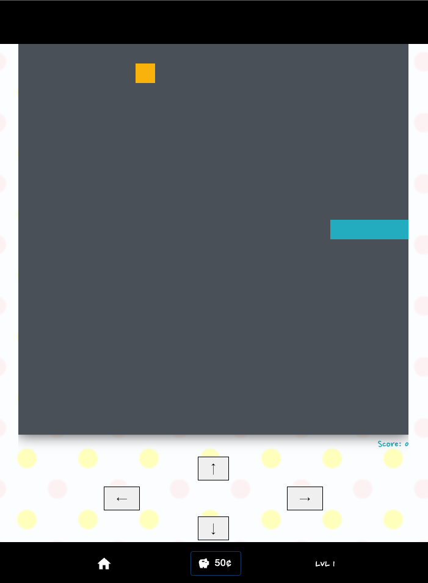
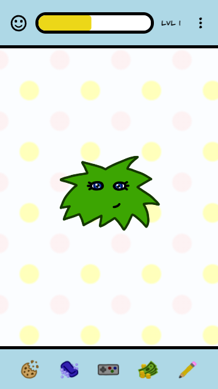

# Pocket Rascal

## Description

## Table of Contents
  - [Description](#description)
  - [Table of Contents](#table-of-contents)
  - [Installation](#installation)
  - [Usage](#usage)
  - [Contributing](#contributing)
  - [License](#license)
  - [Links](#links)
  - [Questions](#questions)
  - [Creators](#creators)

  ## Installation

  Create your own pocket rascal [here!](https://evanhosni.github.io/pocket-rascal/)

  ## Usage 

  
  Login or sign up for an account to access the main home page.
   

  
   
  After sign up, the app will automatically direct you to the create page to make your own Rascal. Follow the prompts to generate and name your Rascal. After you're finished, you will be redirected to the home page. 
 
  
  On the home page, your rascal is displayed and you can interact with him in many different ways. Click the icons in the bottom navigation to feed, wash, and customize your Rascal.
   

  
   
  Customization and interactions will cost you coins! To gain coins and experience to level up your Rascal, click the game controller icon and play a Minigame.
   

   
   
   
  This application was designed to be used on mobile. Use the mobile version of the site to keep your Pocket Rascal with you all the time! 
   

  ## Contributing 

  We are not currently accepting contributions but would love and welcome any feedback.

  ## Links 

  [Deployed Site](https://pocket-rascal.herokuapp.com/)  
  [Repository](https://github.com/evanhosni/pocket-rascal)

  ## Questions 

  Feel free to reach out via Github with any questions. 

  ## Creators
  Development team:  
  Alex Beres - [Github](https://github.com/Alextheshire)  
  Lindsay Fitzgerald - [Github](https://github.com/lindsfitz)  
  Evan Hosni - [Github](https://github.com/evanhosni)  
